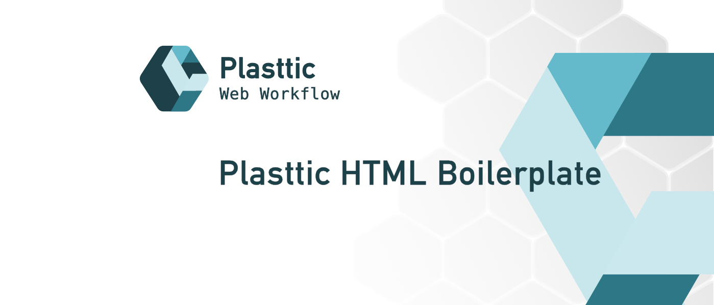

[](https://plasttic.dev)

# Plasttic HTML Boilerplate

A complete HTML starter template.

---

## About

The HTML boilerplate was the beginning of the [Plasttic Workflow](https://github.com/tojeiro-me/Plasttic) project.

The boilerplate provides a complete HTML template that provides the necessary information to search engines and social media sites, performance and more.

- Meta tags for SEO.
- Meta tags for Social Media sharing.
- Google Analytics script.
- Browser icons.
- PWA icons and information.
- Performance:
  - Local hosted fonts preload tags.
  - Google Fonts tags with preconnect.
  - Javascript with defer.
- A simple 404 error page.
- A CSS file with styling for print.
- Stylesheet link for [Plasttic CSS Reset](https://github.com/tojeiro-me/Plasttic-reset).

Note: _also includes optional starter CSS, JS, Fonts and Social Icons._

---

## Start

1. Quick Start

   - Installs the necessary dependencies
   - Creates a folder with the `project name` you defined
   - Downloads and installs the latest version of Plasttic HTML Boilerplate
   - Customize (see below)

```
(cd into your projects folder)
npx create-plasttic
cd project-name
```

1. Download

   - Go to https://github.com/tojeiro-me/Plasttic-boilerplate
   - Click on the `Code` tab and select `Download ZIP`
   - Unzip the file and move the contents of the `public` folder into your project folder
   - Customize (see below)

2. Github New Repo

   - Click this link [Plasttic Boilerplate template](https://github.com/tojeiro-me/Plasttic-boilerplate/generate)
   - Inside the `public` folder are the boilerplate files
   - Customize (see below)

3. Snippet

   - `ptt!` shortcut [VS Code Snippet](https://gist.github.com/tojeiro-me/5ca46d8dcb1cee46b4cda2737e47e6ef)
   - Paste on your global or project snippet file.
   - [More info about VS Code snippets](https://code.visualstudio.com/docs/editor/userdefinedsnippets#_create-your-own-snippets)

---

## Customize

Search for "TODO:" in comments, relative to the information that needs to be changed or checked.

Some information is global, some should be defined per page.

If .##gitignore## exists, rename it to .gitignore and customize to your project info.

If using VS Code, use the [Todo Tree extension](https://marketplace.visualstudio.com/items?itemName=Gruntfuggly.todo-tree)

## Follow

---

[](https://twitter.com/Plasttic_Dev)&emsp;[](https://mastodon.social/@plasttic)&emsp;[](https://github.com/tojeiro-me)

---

## License

[MIT](./LICENSE)

---

[](https://github.com/tojeiro-me/Plasttic)
